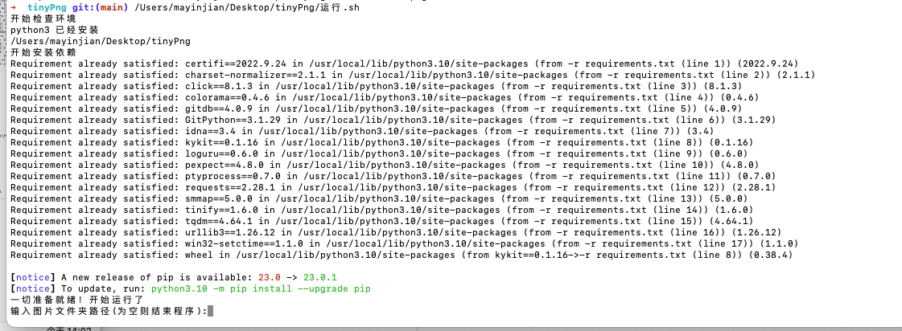
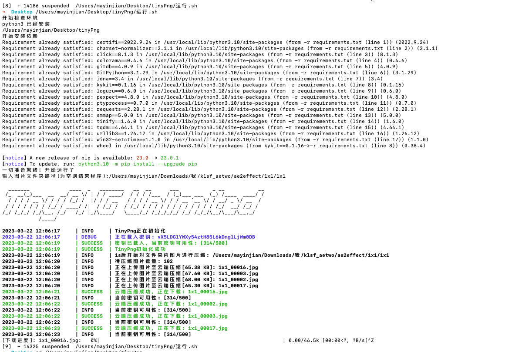

# tinypng_tool

**自动申请API秘钥、多线程、带上传下载进度条的TinyPNG批量云压缩命令行工具**


## 介绍

### TinyPNG

TinyPNG将WebP, PNG and JPEG图片进行智能有损压缩，该压缩对视觉的影响几乎不可见，但是能显著压缩文件体积，以节省空间储存，方便网络传输。

通过邮箱免费申请TinyPNG官方API密钥，可以获得每月500张图片的免费压缩次数（不限文件大小）。

因此，通过API进行图片批量压缩是相对理想的形式，[TinyPNG – Developer API](https://tinypng.com/developers)

### tinypng_tool

> 本项目仅供技术研究使用，请勿用于任何商业及非法用途，任何后果作者概不负责！

**本项目可自动申请API密钥，以多线程形式批量进行TinyPNG压缩，并附带上传、下载和总体任务的进度条，旨在提供最方便快捷的云压缩功能**

本项目实现的功能：

1. 通过多个临时邮箱自动申请TinyPNG官方API密钥，以实现**无限制使用TinyPNG**
2. **自动切换不可用密钥**（即将达到500次免费压缩的密钥）
3. 多线程上传下载图片，**加快批量压缩进度**
4. 可选**使用代理**上传、下载图片
5. 可选**递归子文件夹**，可通过**正则匹配**需要压缩的文件名
6. 可选**通过配置文件批量添加**图片文件名、文件夹任务列表
7. 可选**输出压缩日志**到图片输出文件夹目录
8. 显示上传、下载和总体任务的**进度条**
9. 为每个压缩后的图片添加压缩标记字节（不影响图片内容），**避免重复压缩**
10. 上传、下载带有**超时时间**
11. **压缩错误自动重试**，超出重试次数输出错误文件列表，下次运行时自动重新压缩


## mac一键无脑运行

1. 下载本项目文件
2. 把```运行.sh```直接拖拽到命令行里面，回车运行



## 安装

1. 下载本项目文件
2. 安装依赖
	```
	pip3 install -r requirements.txt
	```

## 使用

1. 压缩单文件
    ```bash
    path\to\your\python3 main.py file "path\to\your\image"
    ```
    
2. 压缩文件夹
   ```bash
   python3 bin/main.py dir --recur
   ```
   
3. 使用配置文件批量压缩
	```bash
    path\to\your\python3 main.py tasks "path\to\tasks.json"
	```
	tasks-emample.json: 
	
	```json
	{
		"file_tasks": ["D:\\1.jpg", "D:\\2.jpg"],
		"dir_tasks": ["D:\\dir1", "D:\\dir2"]
	}
	```
	
4. 申请API密钥

   程序运行时会自动申请密钥，但也可以通过此方式再次申请
	```bash
    path\to\your\python3 main.py apply 4
	```
   
5. 重新排列API密钥顺序

	依次请求获取本地储存的API密钥压缩次数，重新排列密钥顺序
	
	```bash
	path\to\your\python3 main.py rearrange
	```

6. 更多细节请使用命令行帮助，或者打开项目源码查看


## 截图


